# 系统架构图

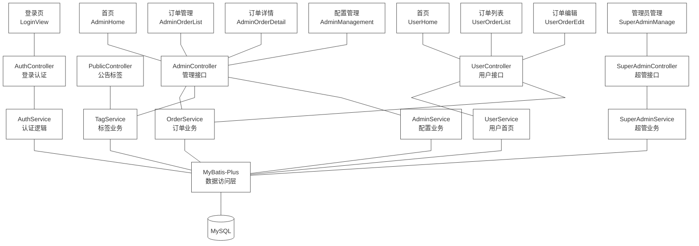

## 模块对照表

| 前端页面 | 对应 API 模块 | 后端 Controller | 后端 Service |
|---|---|---|---|
| 登录页 | auth.ts | AuthController | AuthService |
| 用户首页 | user.ts | UserController | UserService |
| 订单列表 | user.ts | UserController | OrderService |
| 订单编辑 | user.ts | UserController | OrderService |
| 管理首页 | admin.ts | AdminController | OrderService |
| 订单管理 | admin.ts | AdminController | OrderService |
| 订单详情 | admin.ts | AdminController | OrderService |
| 配置管理 | admin.ts | AdminController | TagService, AdminService |
| 超管管理 | superAdmin.ts | SuperAdminController | SuperAdminService |

## 类图

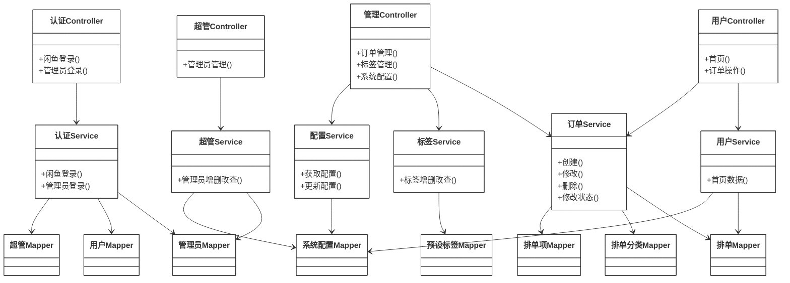

## 用例图

### 超级管理员

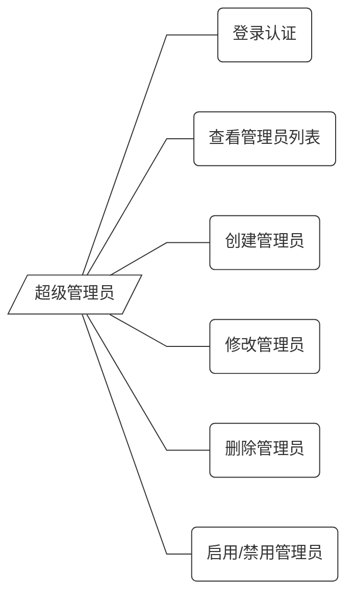

### 管理员

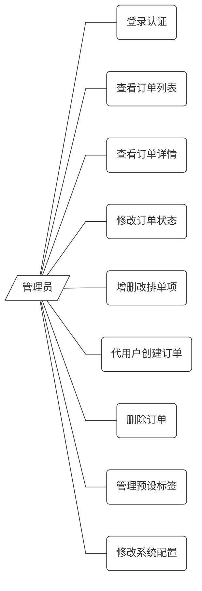

### 闲鱼用户

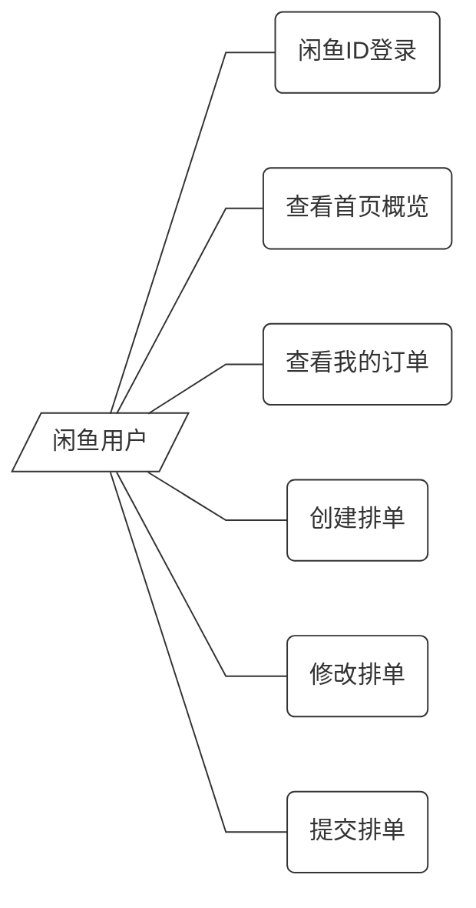

## 协作图

### 用户认证登录

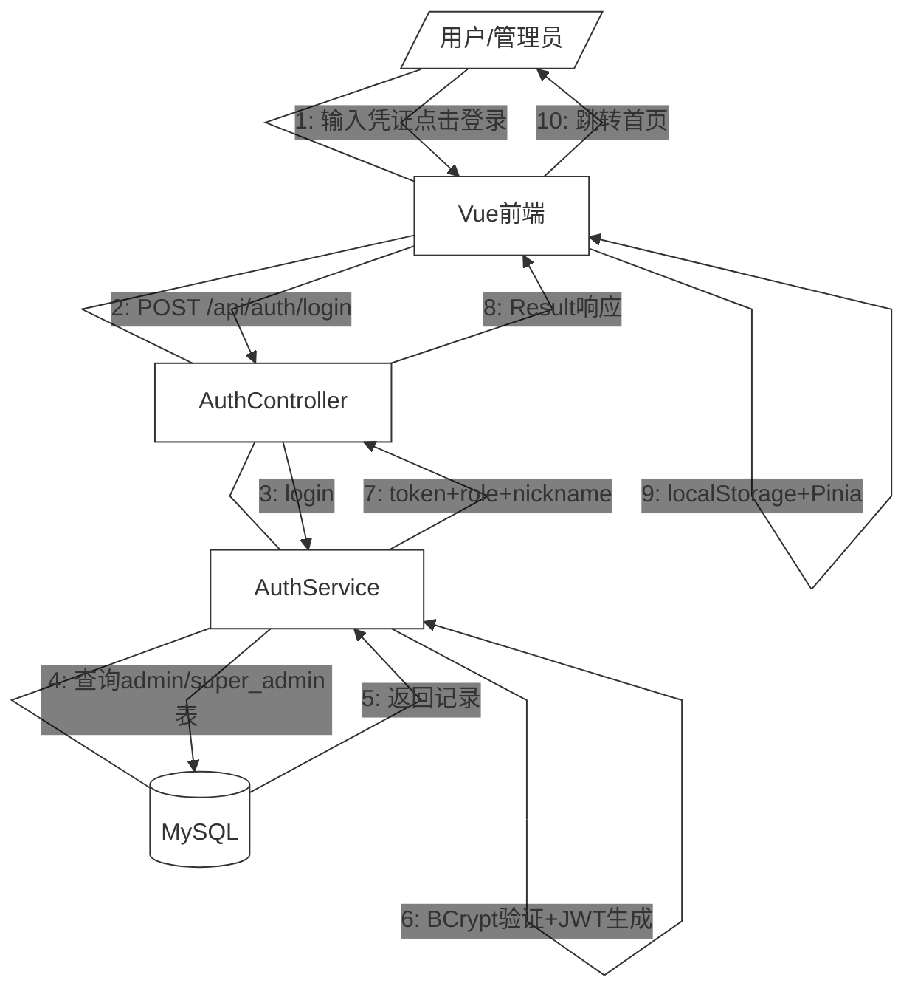

### 排单创建与审核

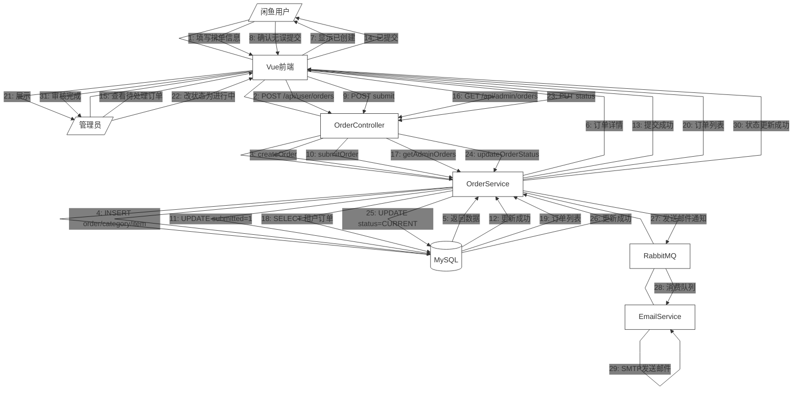

## 时序图

### 排单创建与提交

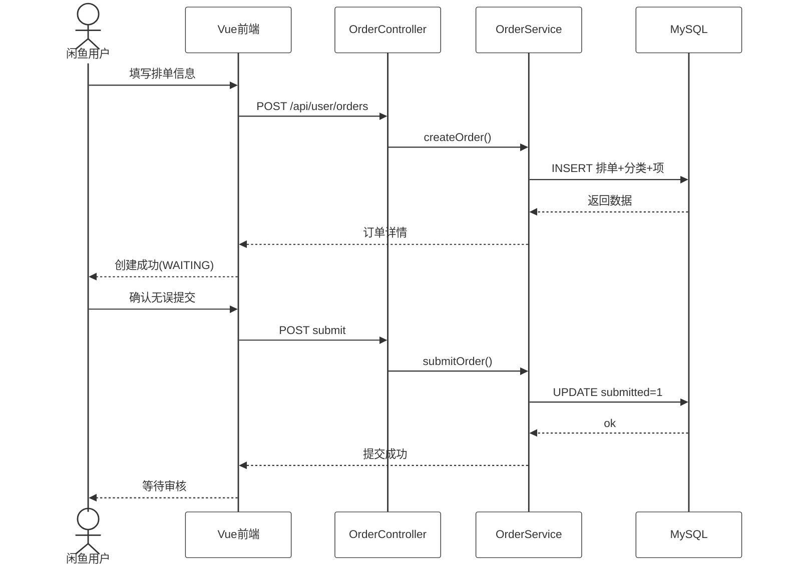

### 订单审核与状态变更

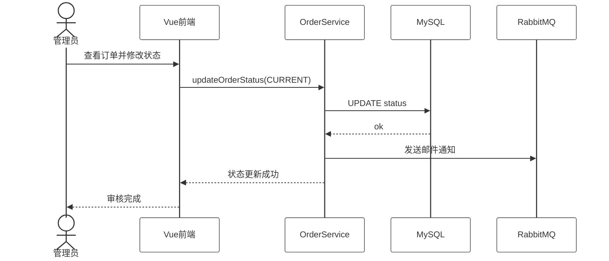

### CDC审计日志采集

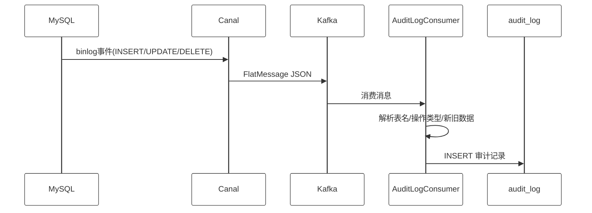

## 状态图

### 排单状态流转

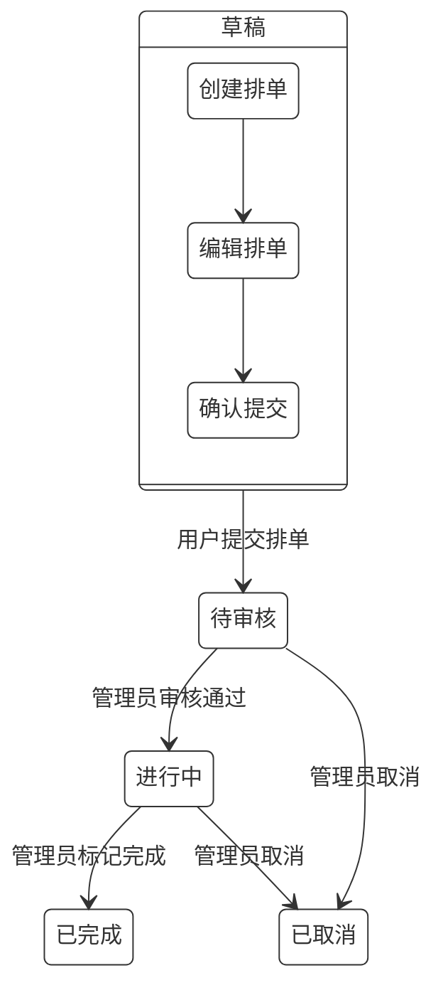

### 订单审核活动

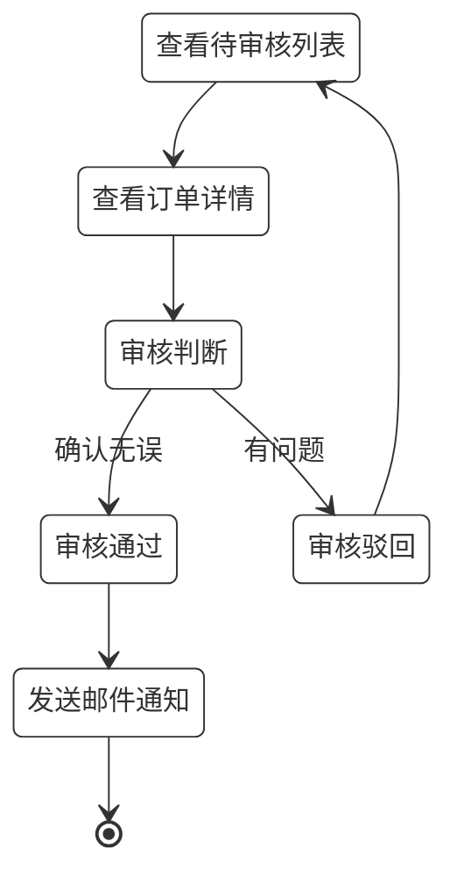

### 用户排单活动

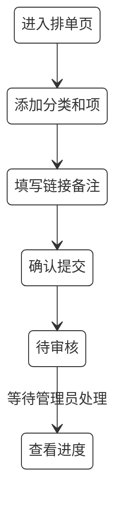

### 预设标签管理

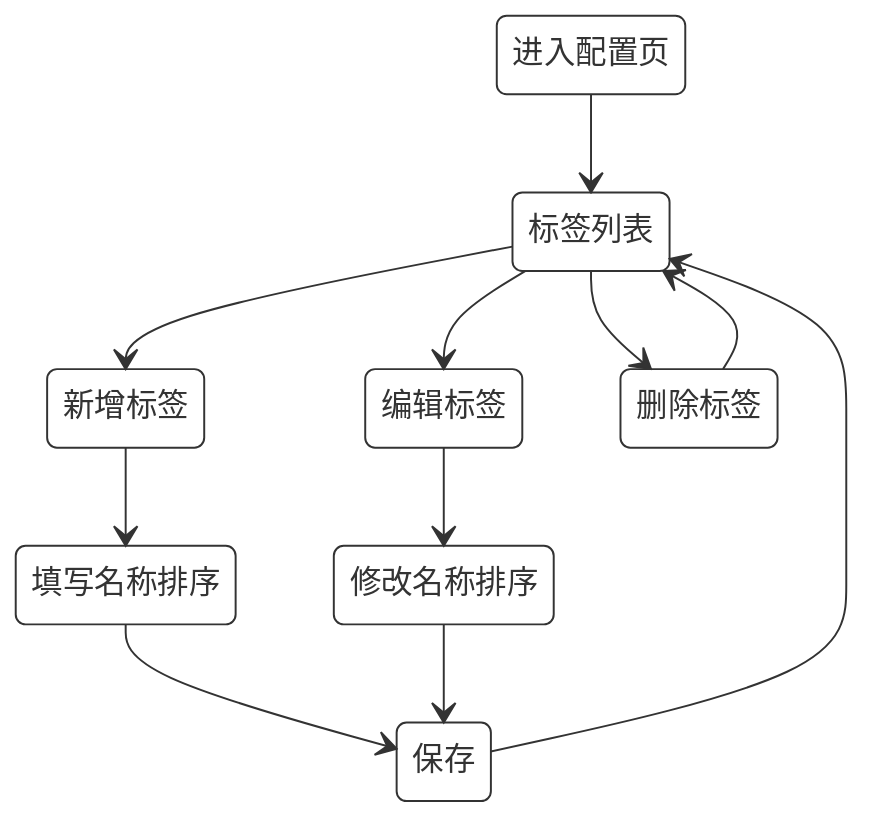

## 数据库表

表4-2-1 super_admin表

字段	类型	字段长	名称
id	BIGINT	null	主键
username	VARCHAR	50	用户名
password_hash	VARCHAR	255	密码哈希
created_at	DATETIME	null	创建时间

表4-2-3 user表

字段	类型	字段长	名称
id	BIGINT	null	主键
tenant_id	VARCHAR	32	租户ID
xianyu_id	VARCHAR	100	闲鱼ID
nickname	VARCHAR	100	用户昵称
avatar_url	VARCHAR	500	用户头像
created_at	DATETIME	null	创建时间

表4-2-4 order表

字段	类型	字段长	名称
id	BIGINT	null	主键
tenant_id	VARCHAR	32	租户ID
user_id	BIGINT	null	用户ID
email	VARCHAR	100	电子邮箱
status	VARCHAR	20	排单状态
total_price	DECIMAL	10,2	总价
submitted	TINYINT	null	是否已提交
created_at	DATETIME	null	创建时间
updated_at	DATETIME	null	更新时间

表4-2-5 order_category表

字段	类型	字段长	名称
id	BIGINT	null	主键
order_id	BIGINT	null	所属排单ID
category_name	VARCHAR	50	分类名称
sort_order	INT	null	排序号
created_at	DATETIME	null	创建时间

表4-2-6 order_item表

字段	类型	字段长	名称
id	BIGINT	null	主键
category_id	BIGINT	null	所属分类ID
link_url	VARCHAR	500	链接URL
note	VARCHAR	500	备注
price	DECIMAL	10,2	价格
status	VARCHAR	20	单项状态
sort_order	INT	null	排序号
created_at	DATETIME	null	创建时间

表4-2-7 preset_tag表

字段	类型	字段长	名称
id	BIGINT	null	主键
tenant_id	VARCHAR	32	租户ID
name	VARCHAR	50	标签名称
sort_order	INT	null	排序号
created_at	DATETIME	null	创建时间

表4-2-8 system_config表

字段	类型	字段长	名称
id	BIGINT	null	主键
tenant_id	VARCHAR	32	租户ID
order_enabled	TINYINT	null	是否启用排单
announcement	TEXT	null	公告内容
